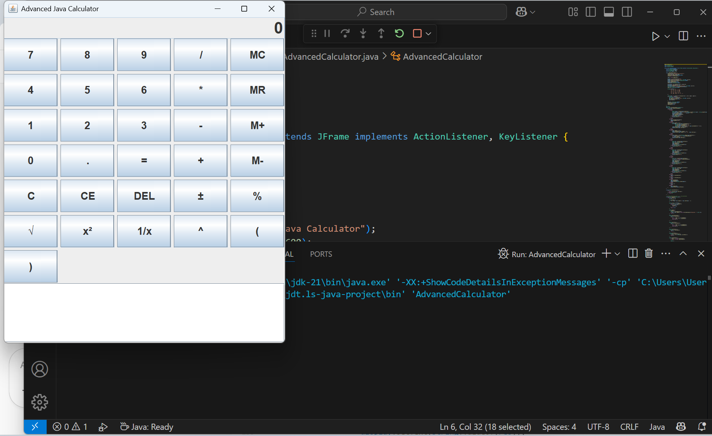
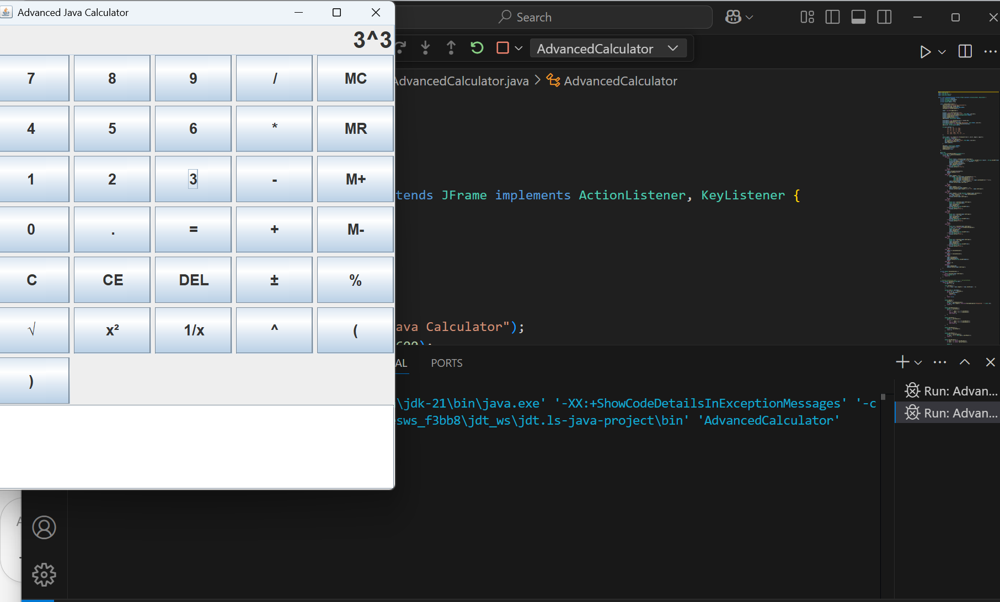
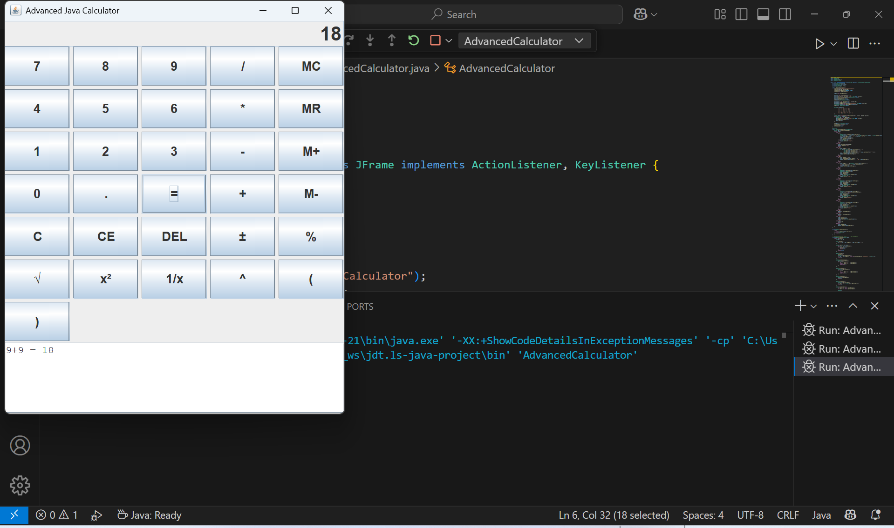
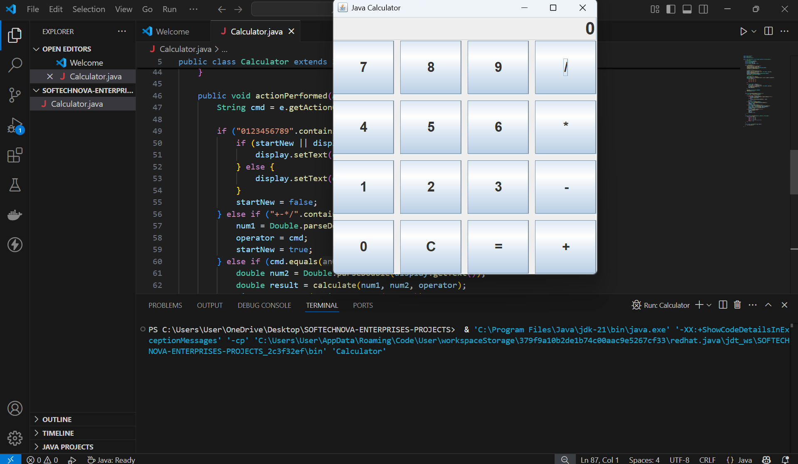
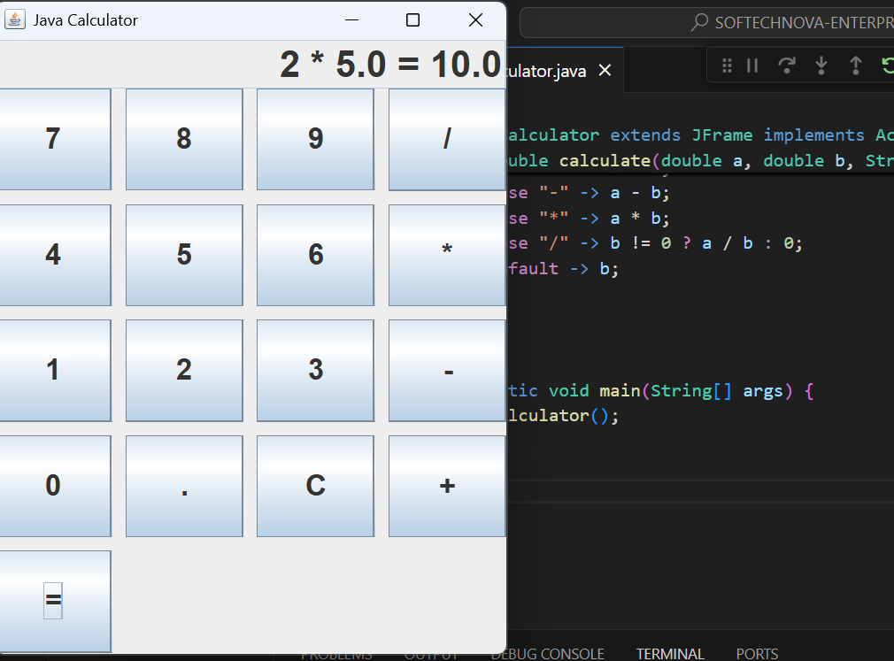

# 🧮 Java Calculator
- ## Advanced
  
 A full-featured desktop calculator built with Java Swing. This calculator supports not just basic arithmetic but also advanced mathematical operations, memory functions, keyboard support, expression parsing with precedence, and a history log.
 <br><br>


<br><br>


<br><br>


  
- ## Basic
 
Basic Calculator — perform addition, subtraction, multiplication, and division with ease.
Features include decimal support, clear/reset function, and a simple, intuitive interface for smooth calculations.
<br><br>


<br><br>





## 🚀 Features

✅ **Basic Arithmetic Operations**  
- Addition, Subtraction, Multiplication, Division

✅ **Advanced Math Functions**  
- Square root (`√`)
- Power (`^`)
- Square (`x²`)
- Percentage (`%`)
- Reciprocal (`1/x`)

✅ **Memory Functions**  
- `M+`: Add current value to memory  
- `M-`: Subtract current value from memory  
- `MR`: Recall memory  
- `MC`: Clear memory  

✅ **Editing Controls**  
- `DEL`: Backspace (delete last character)  
- `C`: Clear all  
- `CE`: Clear current entry  
- `±`: Toggle negative/positive

✅ **Expression Parsing**  
- Supports complex expressions like `3 + 4 * (2 - 1) ^ 2`

✅ **Keyboard Support**  
- Use number keys and operators (`+ - * / ^ ( )`)  
- `Enter` to evaluate  
- `Backspace` to delete  
- Click buttons or type freely!

✅ **History Log**  
- Scrollable view showing all past calculations and results

## 💻 Requirements

- Java 8 or higher
- No external libraries required

## 📦 How to Run

1. **Compile**:
   ```bash
   javac AdvancedCalculator.java
   ```

2. **Run**:
   ```bash
   java AdvancedCalculator
   ```

## 🖱️ Controls Overview

| Button | Function |
|--------|----------|
| `+ - * /` | Arithmetic |
| `=` | Evaluate |
| `C` | Clear all |
| `CE` | Clear entry |
| `DEL` | Backspace |
| `±` | Toggle negative |
| `√`, `x²`, `1/x`, `%`, `^` | Math |
| `M+`, `M-`, `MR`, `MC` | Memory |
| `( )` | Brackets for grouping |

## 🎯 Example Expressions

```txt
(3 + 4) * 2 = 14
5 + 2 ^ 3 = 13
sqrt(16) = 4
```

## 🧠 Notes

- Handles parentheses and operator precedence internally
- Displays floating point only if needed (e.g., `5 / 2 = 2.5`, `4 + 4 = 8`)
- Clean and responsive interface with both mouse and keyboard input

## 📜 License

This project is licensed under the [MIT License](LICENSE).